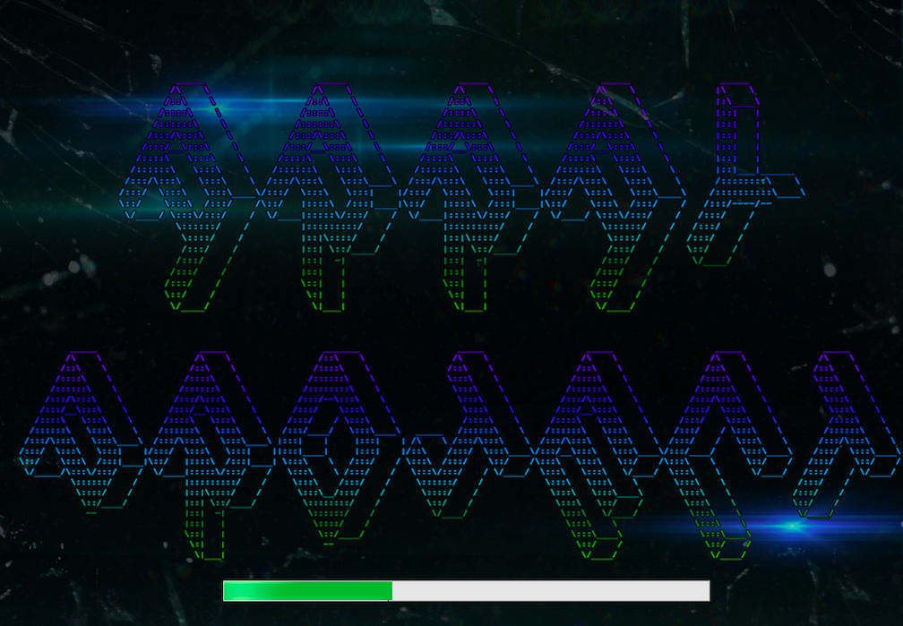
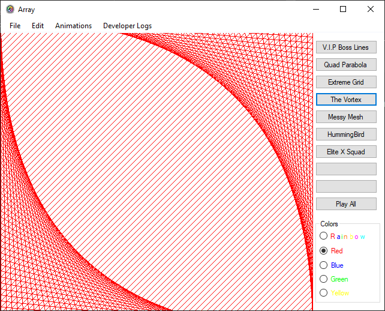
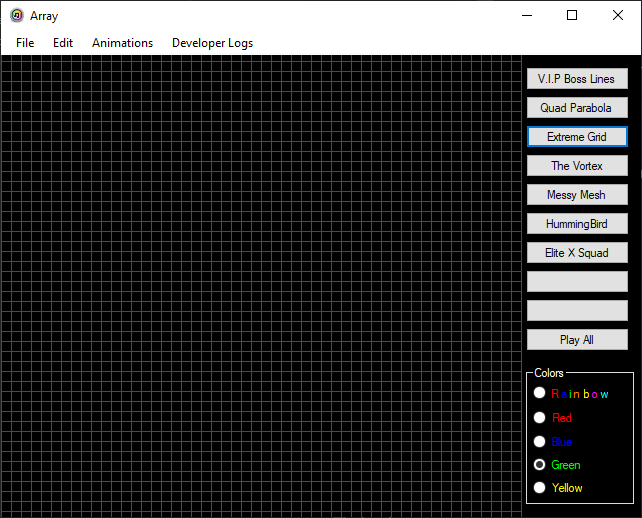
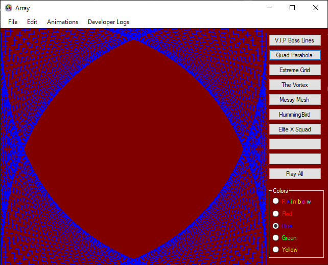
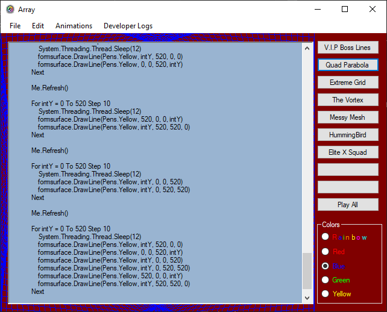
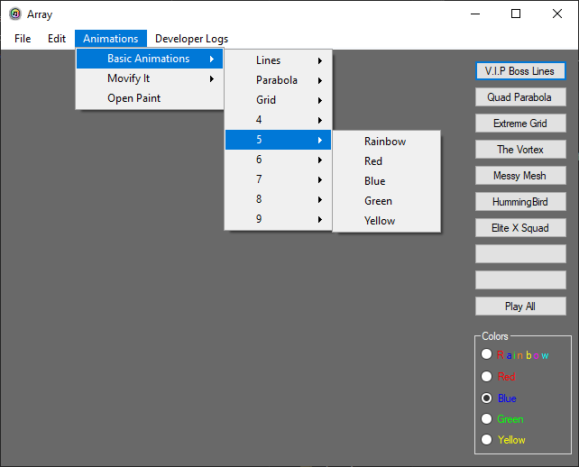
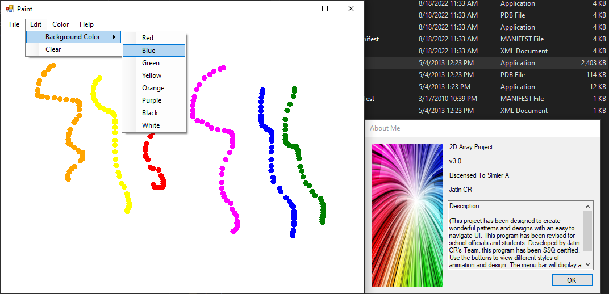

## Synopsis
This application is a simple graphics demonstration tool created in (VB) .NET.
It creates a series of 2D lines across an editable canvas. The color of the
background and lines can be changed to pre-determined options. The lines are
animated in a variety of styles. Using the menu bar, users have the option of:

* Drawing their own artwork via the Paint option
* Viewing the source code for each 2D line animation

Please note that the application is in its early stages. While most of the
groundwork and design have been laid out, a few more 2D animations need to
be added.

## Images
1. Upon starting the program, you are greeted with a peculiar splash screen.
The combination of grungey colors and lens flares gives off a *Star Trek*
vibe. \

2. A simple line animation is *The Vortex*. Here it is done in red. \

3. The background color can be changed. In this instance, it was changed from white to black, and the *Extreme Grid* animation is executed. Notice how even the lines' color can be altered - here it is green. \

4. Four\

5. Five\

6. Six\

7. Seven\

## Compatbility
## Executable

