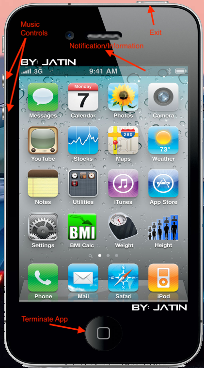
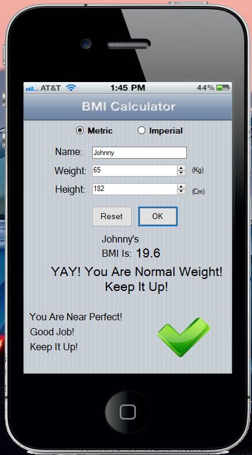
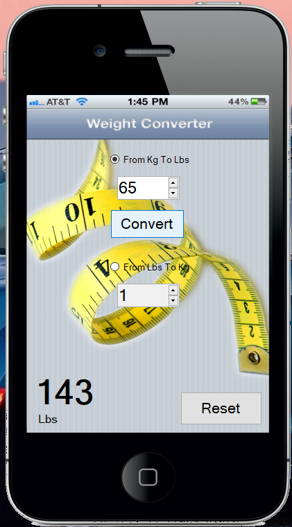
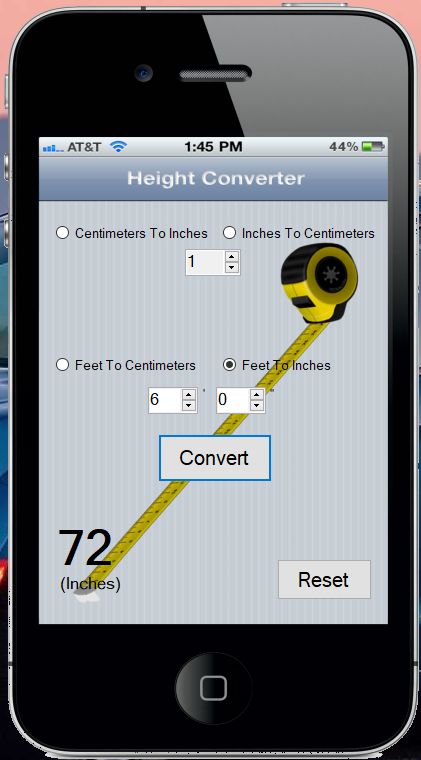
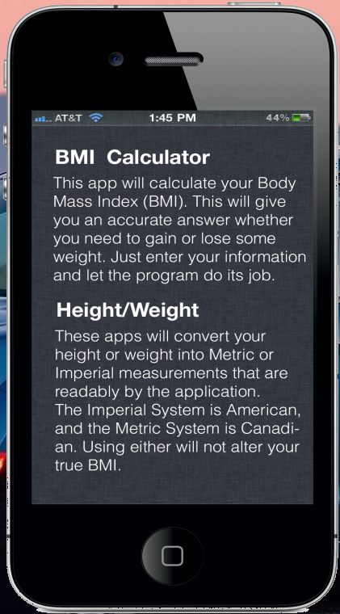

## Synopsis
This application is a BMI calculator, height and weight converter. It is 
presented inside a makeshift iPhone 4 simulator. The entire application
is built in (VB) .NET. While it does not have the full functionality of an
iPhone, it's design is nearly 1:1 of an iPhone 4 running iOS 5. As a bonus,
the application is loaded with funny Easter Eggs. The main apps are:

* BMI Calculator
* Height Converter
* Weight Converter

As a bonus, it can play music. Just press the music icon to get started.
To start/stop playback, use the appropriate volume buttons. To exit the
application entirely, press the lock button on the iPhone 4.

## Images
1. The on-screen controls function very similar to an iPhone. Press the
   power button to exit the application. The home button terminates the
   app you are in. Pressing the notification bar brings down information.
   The volume buttons control music; just like regular phones. \

2. The BMI app calculates your body mass index. Input your name, weight,
   and height, and the app will do the rest for you. You can choose
   between Metric or Imperial units. *Note: There is an Easter Egg here.
   See if you can find it!* \

3. The Weight Converter app can convert weight from kilograms to pounds,
   and pounds to kilograms. This is useful if you know your measurements
   in one unit, but not the other. \

4. The Height Converter app can convert your height from Centimetres to
   Inches, Inches to Centimetres, Feet to Centimeters, and Feet to Inches.
   This is super helpful, because converting between these can be
   cumbersome.\

5. Swiping down from the notification bar reveals information about the
   applications, what they do, and how it works. The design follows iOS'
   strict skeuomorphic standards. The metal background makes everything
   look more official. \

## Compatbility
This application is fully compatible with **Windows 7** and **Windows 10**.
Other versions are not officially supported.

## Executable
The executable is too large to host on *GitHub*, and I'm running out of
space. The total size of the *EXE* is ~149 MB. If you would like a copy,
please send me a message, and I will be happy to send you the respective
executable. Thank you!
