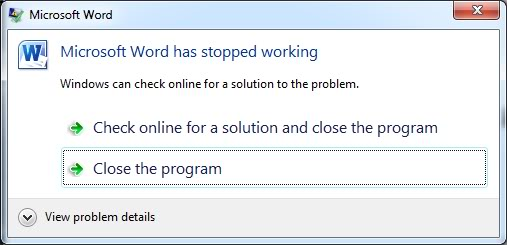

## Synopsis
This application is a covert Halo & Counterstrike launcher. It is designed
to play Halo/Counterstrike in a windowed mode inside of a window that looks
Microsoft Word or Microsoft PowerPoint. Secret keywords like *Play* and
*Patch* are used to trigger the executable and terminate it. Upon exit,
all traces of either game are wiped. The games are launched via a self-
executing ZIP that is designed to be portable. Meaning, it does not install
any files to local storage *(i.e. C:\ Drive)*. All files are temporary and
the application ensures the deletion of permanent files like *Saved
Profiles* and *Settings*. 

The program includes over 15 documents that can disguise one's *work*. None
will be the wiser. No one will know that your History homework is Halo
in disguise. Documents include:

* Trignometry (DOCX)
* Shakespeare (DOCX)
* History (DOCX)
* Chemistry (PPT)
* Civics (PPT)

When you start the application, click on the appropriate icon to bring
up your desired document. If you are confused, the starting page has
crystal clear instructions.

## Halo
The Halo game that is bundled in this program is Combat Evolved (CE). It
is the compact version. Meaning, it contains the best maps like Bloodgulch
and Hang 'Em High. All bloatware is removed for speed, performance, and
storage optimization. It includes all kinds of gamemodes to suit your style.
As a bonus, it even supports LAN, which is perfect for school!

## How-To
Here is a quick breakdown of how to use this application:
1. Select either Word or Powerpoint to load a document; click on repestive
   icons for previews.
2. Once the document is opened, search for bold keywords like *Play*,
   *Patch*, and *Leave*. These words will allow you to perform various
   tasks once clicked.
* *Play: Launches HaloCE. Be patient because this can take upto a minute
   on older hardware*
* *Patch: Delete all traces of HaloCE*
* *Leave: Exit the document and return to the landing/starter page*
3. After playing Halo, press the *Patch* keyword to cover your tracks.
4. Use the *Bug* button in *Extras* to report any issues. Thank you!

## Images
1. When the program is executed, this is the starting page. Use the blue
   arrows at the buttom to flip between the introduction and
   information page. Note that you can scroll in these boxes. The *Info*
   tab is what you see right now, and the *Extra* tab contains things
   such as Bug submission, User guide, etc. The Counterstrike button at
   the bottom right allows you to switch to the CS page. More
   information below. \

2. Clicking on the Word or PowerPoint icons brings up an information
   dialog box containing information about the various documents that
   are available for covert operations. \

3. Clicking on the subject under the icon brings up a panel of
   documents to choose from. In the following picture, *English*
   has four documents available. \

4. This is an informational page that explains how to use the
   fake window to launch and exit HaloCE. Even though the window
   looks like WordPad, it applies 1:1 to Microsoft Word.
   Nonetheless, it merely serves as a How-To for beginners. \

5. The documents allow scrolling and editing. You can easily
   alter the document to your heart's content. It makes
   everything seem more legitimate. If you experience SOS,
   then you can start typing away. Once SOSG, then you can
   switch back to HaloCE. Genius! \

6. In case of emergencies, you can press anywhere on the toolbar
   to quickly crash the entire program. Upon doing so, you will
   receive the following error message. From here, you can click
   anywhere, and you are home free. \

7. Example of using a PPT to discreetly play Halo. Pressing the
   *Play* button will start the executable. \

8. In the same slide deck from before, find the *Patched* keyword
   to delete all traces of Halo before turning off the machine. \

9. Once you have covered your tracks, you can exit the program \

10. Extra options available in the *Extra* tab: \

11. What the CS page looks like. It is very simple because CS is
    "safer" than Halo in terms of detectability. \

## Compatbility
This application is fully compatible with **Windows 7** and **Windows 10**.
Other versions are not officially supported.

## Executable
The executables are too large to host on *GitHub*, and I'm running out of
space. The total size of the *EXE* are ~171 MB and ~91 MB, respectively.
If you would like a copy, please send me a message, and I will be happy
to send you the respective executable. Thank you!
